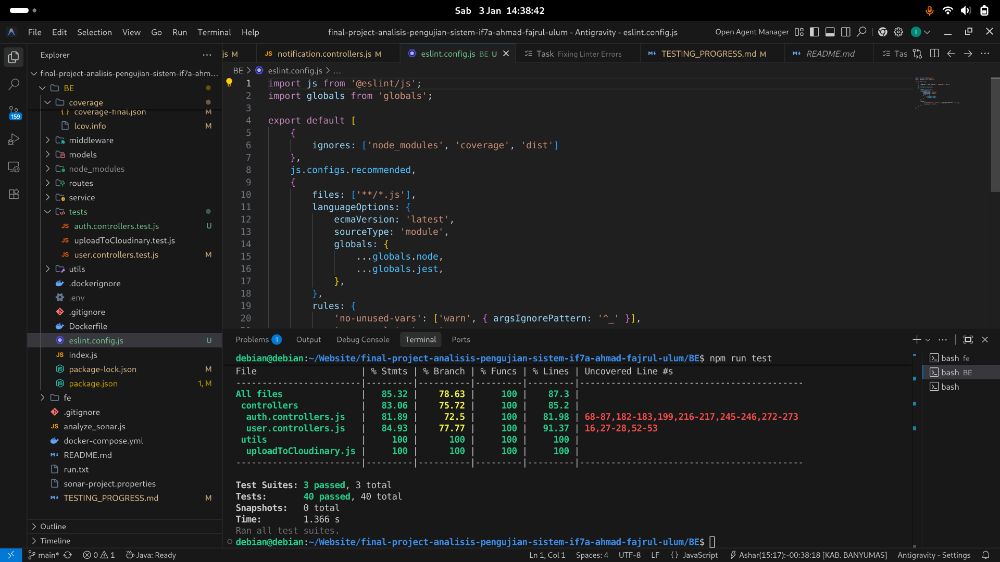
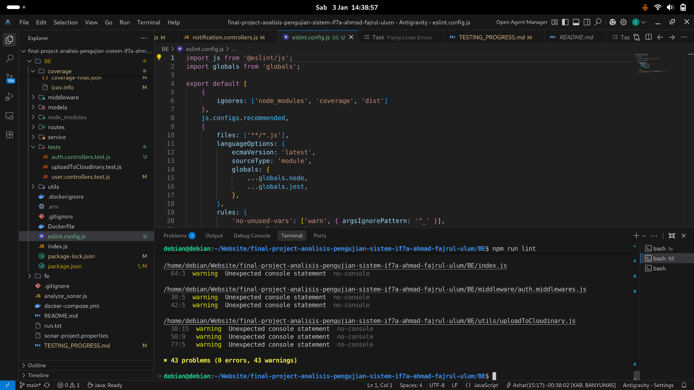
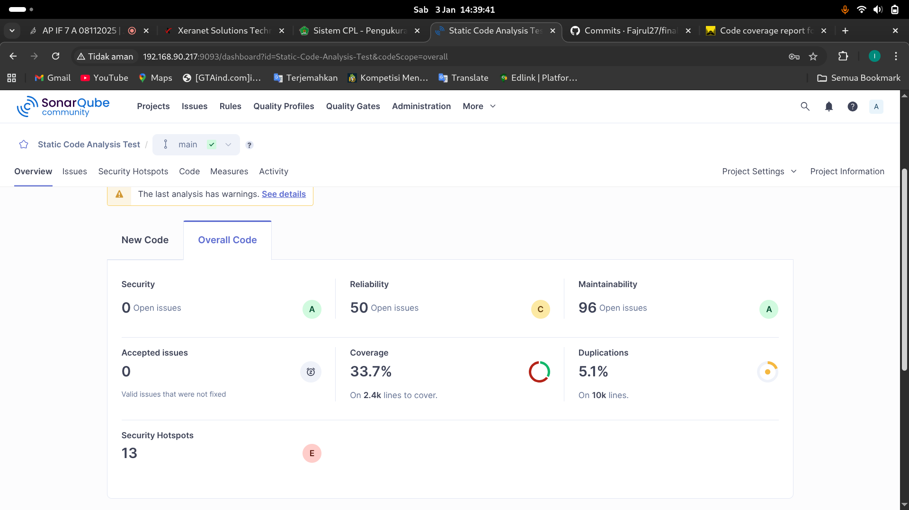

# Mata Kuliah: Analisis & Pengujian Sistem IF7A





## Informasi Kelompok

**Mata Kuliah:** Analisis & Pengujian Sistem

**Ketua Kelompok:** Ahmad-Fajrul-'Ulum(22EO10027)

**Anggota:**
- Nourman-Rofiandi(22EO10021)
- Cholifah-Kusuma-Dewi(22EO10010)
- Randika-Damar-Hanaseru(22EO10011)
- Ahmad-Mustaufiq(22EO10006)
---

## Deskripsi Proyek

Repositori ini berisi artefak, dokumen, dan kode yang berkaitan dengan tugas mata kuliah Analisis & Pengujian Sistem. 

**Tujuan Proyek:**
Proyek ini bertujuan untuk menganalisis kebutuhan, merancang arsitektur, dan mengimplementasikan pengujian fungsional untuk sistem informasi manajemen perpustakaan yang terintegrasi dengan fitur autentikasi, manajemen konten, dan notifikasi real-time.

**Fitur Utama:**
- Sistem Autentikasi & Otorisasi
- Manajemen Konten (Blog, Hero, Iklan, Logo PT)
- Manajemen Testimoni & Rating
- Sistem Notifikasi Real-time
- Dashboard Admin
- Upload & Manajemen Media (Cloudinary)
- Two-Factor Authentication (2FA)

---

## Desain Proyek (Unified Modeling Language)

### Use Case Diagram

**Aktor Utama:**
1. **Admin** - Mengelola konten, pengguna, dan sistem
2. **User** - Mengakses konten dan fitur publik
3. **System** - Mengirim notifikasi dan email

**Use Case Utama:**
- **Authentication:** Login, Register, Forgot Password, Reset Password, 2FA Verification
- **Content Management:** Create/Read/Update/Delete Blog, Hero, Iklan, Logo PT, Testimoni
- **User Management:** Manage Users, Edit Profile, View Dashboard
- **Notification:** Send Notification, View Notification History
- **Media Management:** Upload Media, Delete Media, View Media

### Sequence Diagram

**Login Flow:**
```
User -> Frontend -> Backend -> Database
  |        |          |          |
  |------->|          |          |
  |        |--------->|          |
  |        |          |--------->|
  |        |          |<---------|
  |        |<---------|          |
  |<-------|          |          |
```

**Create Blog Post:**
```
Admin -> Frontend -> Backend -> Database -> Cloudinary
  |        |          |          |            |
  |------->|          |          |            |
  |        |--------->|          |            |
  |        |          |--------->|            |
  |        |          |          |<-----------|
  |        |          |<---------|            |
  |        |<---------|          |            |
  |<-------|          |          |            |
```

### Activity Diagram

**User Registration Flow:**
```
Start
  ↓
Input Email & Password
  ↓
Validate Input
  ↓
Email Already Exists? → Yes → Show Error → End
  ↓ No
Hash Password
  ↓
Save to Database
  ↓
Send Verification Email
  ↓
User Verifies Email
  ↓
Account Active
  ↓
End
```

**Admin Content Management Flow:**
```
Start
  ↓
Login as Admin
  ↓
Access Dashboard
  ↓
Select Content Type (Blog/Hero/Iklan/etc)
  ↓
Choose Action (Create/Edit/Delete)
  ↓
Fill Form & Upload Media
  ↓
Validate Data
  ↓
Save to Database & Cloudinary
  ↓
Show Success Message
  ↓
End
```

---

## Arsitektur Proyek (Unified Modeling Language)

### Arsitektur Umum

Proyek ini menggunakan **3-Tier Architecture** dengan pemisahan yang jelas antara Frontend, Backend, dan Database:

```
┌─────────────────────────────────────────────────────────────┐
│                    PRESENTATION LAYER                        │
│  ┌──────────────────┐  ┌──────────────────┐                 │
│  │  Admin Frontend  │  │   FE Frontend    │                 │
│  │   (React/Vite)   │  │   (React/Vite)   │                 │
│  └──────────────────┘  └──────────────────┘                 │
│         Port: 3000           Port: 5175                      │
└─────────────────────────────────────────────────────────────┘
                              ↓ HTTP/REST API
┌─────────────────────────────────────────────────────────────┐
│                    BUSINESS LOGIC LAYER                      │
│  ┌──────────────────────────────────────────────────────┐   │
│  │         Express.js Backend Server                    │   │
│  │  ┌────────────────────────────────────────────────┐  │   │
│  │  │  Routes & Controllers                          │  │   │
│  │  │  - Auth Routes                                 │  │   │
│  │  │  - Blog Routes                                 │  │   │
│  │  │  - Hero Routes                                 │  │   │
│  │  │  - Iklan Routes                                │  │   │
│  │  │  - LogoPT Routes                               │  │   │
│  │  │  - Testimoni Routes                            │  │   │
│  │  │  - Notification Routes                         │  │   │
│  │  │  - User Routes                                 │  │   │
│  │  └────────────────────────────────────────────────┘  │   │
│  │  ┌────────────────────────────────────────────────┐  │   │
│  │  │  Middleware                                    │  │   │
│  │  │  - Authentication                              │  │   │
│  │  │  - CORS & Security (Helmet, CSP)              │  │   │
│  │  │  - File Upload (Multer)                        │  │   │
│  │  └────────────────────────────────────────────────┘  │   │
│  │  ┌────────────────────────────────────────────────┐  │   │
│  │  │  Services                                      │  │   │
│  │  │  - OTP Generation                              │  │   │
│  │  │  - ID Token Management                         │  │   │
│  │  │  - Email Service (Nodemailer)                  │  │   │
│  │  │  - Cloudinary Upload                           │  │   │
│  │  └────────────────────────────────────────────────┘  │   │
│  └──────────────────────────────────────────────────────┘   │
│                      Port: 5003                              │
└─────────────────────────────────────────────────────────────┘
                              ↓ MongoDB Driver
┌─────────────────────────────────────────────────────────────┐
│                    DATA ACCESS LAYER                         │
│  ┌──────────────────────────────────────────────────────┐   │
│  │  MongoDB Database                                    │   │
│  │  ┌────────────────────────────────────────────────┐  │   │
│  │  │  Collections:                                  │  │   │
│  │  │  - Users                                       │  │   │
│  │  │  - Blogs                                       │  │   │
│  │  │  - Heroes                                      │  │   │
│  │  │  - Iklans                                      │  │   │
│  │  │  - LogoPTs                                     │  │   │
│  │  │  - Testimonis                                  │  │   │
│  │  │  - Notifications                               │  │   │
│  │  └────────────────────────────────────────────────┘  │   │
│  └──────────────────────────────────────────────────────┘   │
└─────────────────────────────────────────────────────────────┘
```

### Komponen Eksternal

```
┌─────────────────────────────────────────────────────────────┐
│                  EXTERNAL SERVICES                           │
│  ┌──────────────┐  ┌──────────────┐  ┌──────────────┐      │
│  │  Firebase    │  │  Cloudinary  │  │  Nodemailer  │      │
│  │  (Auth/DB)   │  │  (Media CDN)  │  │  (Email)     │      │
│  └──────────────┘  └──────────────┘  └──────────────┘      │
└─────────────────────────────────────────────────────────────┘
```

### Alur Data

1. **User Request** → Frontend (React)
2. **HTTP Request** → Backend (Express.js)
3. **Validation & Processing** → Controllers & Services
4. **Database Query** → MongoDB
5. **Response** → Frontend
6. **Render UI** → User

---

## Tech Stack

### Frontend

| Teknologi | Versi | Fungsi |
|-----------|-------|--------|
| **React** | 19.0.0 | UI Framework |
| **Vite** | 6.2.0 | Build Tool & Dev Server |
| **Redux Toolkit** | 2.6.1 | State Management |
| **React Router** | 7.5.0 | Routing |
| **Tailwind CSS** | 4.1.3 | Styling |
| **DaisyUI** | 5.0.12 | UI Components |
| **Axios** | 1.8.4 | HTTP Client |
| **React Query** | 5.71.10 | Data Fetching & Caching |
| **React Hook Form** | 7.55.0 | Form Management |
| **Firebase** | 11.6.0 | Authentication & Realtime DB |
| **Framer Motion** | 12.9.4 | Animation |
| **Chart.js** | 4.4.9 | Data Visualization |

### Backend

| Teknologi | Versi | Fungsi |
|-----------|-------|--------|
| **Node.js** | 20.14.0 | Runtime |
| **Express.js** | 4.21.2 | Web Framework |
| **MongoDB** | 8.12.2 | Database (via Mongoose) |
| **Mongoose** | 8.12.2 | ODM (Object Data Modeling) |
| **Firebase Admin** | 13.2.0 | Firebase Integration |
| **Bcrypt** | 5.1.1 | Password Hashing |
| **JWT** | - | Token Authentication |
| **Nodemailer** | 6.10.1 | Email Service |
| **Cloudinary** | 2.6.0 | Media Management & CDN |
| **Multer** | 1.4.5 | File Upload Handling |
| **CORS** | 2.8.5 | Cross-Origin Resource Sharing |
| **Helmet** | 8.1.0 | Security Headers |
| **Dotenv** | 16.4.7 | Environment Variables |
| **Nodemon** | 3.1.10 | Development Auto-reload |

### Database

| Teknologi | Fungsi |
|-----------|--------|
| **MongoDB** | NoSQL Database |
| **Mongoose** | Schema Validation & ODM |

### External Services

| Layanan | Fungsi |
|---------|--------|
| **Firebase** | Authentication, Realtime Database |
| **Cloudinary** | Image/Media Storage & CDN |
| **Nodemailer** | Email Delivery |

### DevOps & Deployment

| Teknologi | Fungsi |
|-----------|--------|
| **Docker** | Containerization |
| **Docker Compose** | Multi-container Orchestration |
| **Nginx** | Reverse Proxy & Web Server |

---

## Struktur Direktori

```
XeranetID/
├── Admin/                          # Admin Dashboard Frontend
│   ├── src/
│   │   ├── app/                   # Redux Store & Slices
│   │   ├── components/            # React Components
│   │   ├── pages/                 # Page Components
│   │   ├── services/              # API Services
│   │   ├── auth/                  # Authentication
│   │   ├── context/               # React Context
│   │   ├── middleware/            # Route Middleware
│   │   ├── Layout/                # Layout Components
│   │   ├── App.jsx
│   │   ├── main.jsx
│   │   └── index.css
│   ├── package.json
│   ├── vite.config.js
│   └── Dockerfile
│
├── BE/                             # Backend Server
│   ├── config/                    # Configuration Files
│   │   ├── db.js                  # MongoDB Connection
│   │   ├── firebase.js            # Firebase Config
│   │   ├── cloudinary.js          # Cloudinary Config
│   │   └── mailer.js              # Email Config
│   ├── controllers/               # Route Controllers
│   │   ├── auth.controllers.js
│   │   ├── blog.controllers.js
│   │   ├── hero.controllers.js
│   │   ├── iklan.controllers.js
│   │   ├── logoPT.controllers.js
│   │   ├── testimoni.controllers.js
│   │   ├── notification.controllers.js
│   │   └── user.controllers.js
│   ├── models/                    # Mongoose Models
│   │   ├── user.models.js
│   │   ├── blog.models.js
│   │   ├── hero.models.js
│   │   ├── iklan.models.js
│   │   ├── logoPT.models.js
│   │   ├── testimoni.models.js
│   │   └── notification.models.js
│   ├── routes/                    # API Routes
│   │   ├── auth.routes.js
│   │   ├── blog.routes.js
│   │   ├── hero.routes.js
│   │   ├── iklan.routes.js
│   │   ├── logoPT.routes.js
│   │   ├── testimoni.routes.js
│   │   ├── notification.routes.js
│   │   └── user.routes.js
│   ├── middleware/                # Express Middleware
│   │   ├── auth.middlewares.js
│   │   ├── csp.js
│   │   └── multer.js
│   ├── service/                   # Business Logic Services
│   │   ├── generateOTP.js
│   │   └── id.token.js
│   ├── utils/                     # Utility Functions
│   │   └── uploadToCloudinary.js
│   ├── index.js                   # Entry Point
│   ├── package.json
│   ├── .env
│   └── Dockerfile
│
├── fe/                             # Frontend (Landing Page)
│   ├── src/
│   ├── package.json
│   ├── vite.config.js
│   └── Dockerfile
│
├── docker-compose.yml             # Docker Compose Configuration
└── README.md                       # This File
```

---

## Cara Menjalankan Proyek

### Prerequisites

- Node.js v20.14.0 atau lebih tinggi
- npm atau yarn
- MongoDB (Cloud atau Local)
- Docker & Docker Compose (opsional)

### Setup Lokal

#### 1. Clone Repository
```bash
git clone <repository-url>
cd XeranetID
```

#### 2. Setup Backend

```bash
cd BE
npm install
```

Buat file `.env` dengan konfigurasi:
```env
PORT=5003
MONGOURI=<your-mongodb-uri>
FIREBASEADMINSERVICEKEY=<your-firebase-key>
FIREBASEAPIKEY=<your-firebase-api-key>
CLOUDINARY_NAME=<your-cloudinary-name>
CLOUDINARY_APIKEY=<your-cloudinary-api-key>
CLOUDINARY_APISECRET=<your-cloudinary-secret>
EMAIL=<your-email>
PASSWORD=<your-email-password>
FE_PORT=http://localhost:3000
```

Jalankan Backend:
```bash
npm start
```

Backend akan berjalan di `http://localhost:5003`

#### 3. Setup Admin Frontend

```bash
cd Admin
npm install
npm run dev
```

Admin Dashboard akan berjalan di `http://localhost:3000`

#### 4. Setup FE Frontend

```bash
cd fe
npm install
npm run dev
```

Frontend akan berjalan di `http://localhost:5175`

### Setup dengan Docker

```bash
docker-compose up -d
```

---

## API Endpoints

### Authentication
- `POST /api/auth/register` - Register User
- `POST /api/auth/login` - Login User
- `POST /api/auth/logout` - Logout User
- `POST /api/auth/forgot-password` - Forgot Password
- `POST /api/auth/reset-password` - Reset Password
- `POST /api/auth/verify-2fa` - Verify 2FA

### Blog
- `GET /api/blog` - Get All Blogs
- `GET /api/blog/:id` - Get Blog by ID
- `POST /api/blog` - Create Blog (Admin)
- `PUT /api/blog/:id` - Update Blog (Admin)
- `DELETE /api/blog/:id` - Delete Blog (Admin)

### Hero
- `GET /api/hero` - Get All Heroes
- `POST /api/hero` - Create Hero (Admin)
- `PUT /api/hero/:id` - Update Hero (Admin)
- `DELETE /api/hero/:id` - Delete Hero (Admin)

### Iklan
- `GET /api/iklan` - Get All Iklans
- `POST /api/iklan` - Create Iklan (Admin)
- `PUT /api/iklan/:id` - Update Iklan (Admin)
- `DELETE /api/iklan/:id` - Delete Iklan (Admin)

### Testimoni
- `GET /api/testimoni` - Get All Testimonis
- `POST /api/testimoni` - Create Testimoni
- `PUT /api/testimoni/:id` - Update Testimoni (Admin)
- `DELETE /api/testimoni/:id` - Delete Testimoni (Admin)

### User
- `GET /api/user` - Get All Users (Admin)
- `GET /api/user/:id` - Get User by ID
- `PUT /api/user/:id` - Update User Profile
- `DELETE /api/user/:id` - Delete User (Admin)

### Notification
- `GET /api/notification` - Get All Notifications
- `POST /api/notification` - Create Notification (Admin)
- `DELETE /api/notification/:id` - Delete Notification

---

## Testing

### Unit Testing
```bash
npm test
```

### Integration Testing
```bash
npm run test:integration
```

### E2E Testing
```bash
npm run test:e2e
```

---

## Dokumentasi Tambahan

- [API Documentation](./docs/API.md)
- [Database Schema](./docs/DATABASE.md)
- [Architecture Design](./docs/ARCHITECTURE.md)
- [Testing Strategy](./docs/TESTING.md)

---

## Kontribusi

Untuk berkontribusi pada proyek ini:

1. Fork repository
2. Buat branch fitur (`git checkout -b feature/AmazingFeature`)
3. Commit perubahan (`git commit -m 'Add some AmazingFeature'`)
4. Push ke branch (`git push origin feature/AmazingFeature`)
5. Buat Pull Request

---

## Lisensi

Proyek ini dilisensikan di bawah MIT License - lihat file [LICENSE](LICENSE) untuk detail.

---

**Last Updated:** 2025
**Status:** Active Development

